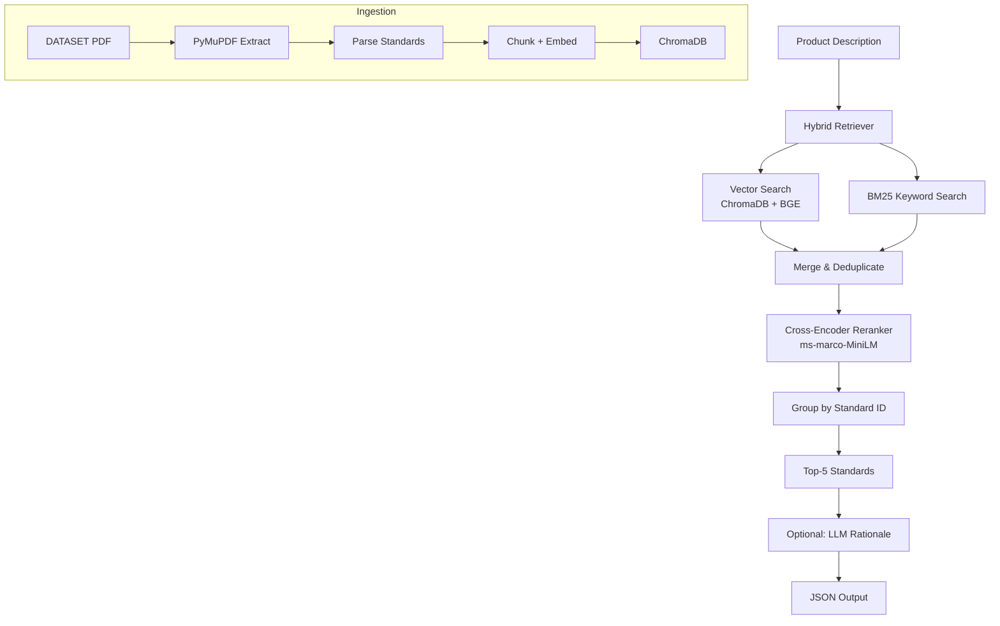

# BIS Standards Recommendation Engine

> **A hybrid RAG pipeline that recommends applicable Bureau of Indian Standards (BIS) for building material products.**

Given a product description (e.g. *"Portland cement for general construction use in humid environments"*), the engine retrieves the top 3–5 relevant BIS standards from a curated knowledge base built from **BIS SP 21** — *Summaries of Indian Standards for Building Materials*.

---

## Architecture



### Retrieval Strategy

The engine uses a **three-phase hybrid retrieval** approach:

| Phase | Method | Purpose |
|-------|--------|---------|
| **1. Recall** | Vector search (top-20) + BM25 (top-20) | Cast a wide net for candidates |
| **2. Rerank** | Cross-encoder (`ms-marco-MiniLM-L-6-v2`) | Semantic precision scoring |
| **3. Group** | Group by `standard_id`, best chunk per standard | Deduplicate & rank |

---

## Quick Start

### 1. Install dependencies

```bash
pip install -r requirements.txt
```

### 2. Set up environment

```bash
cp .env.example .env
# Edit .env with your configuration
```

### 3. Ingest the BIS PDF

```bash
python scripts/ingest_bis.py --pdf data/dataset.pdf
```

### 4. Run inference

```bash
python inference.py --input data/public_test_set.json --output results.json
python3 eval_script.py --results results.json
```

### 5. Evaluate results

```bash
python eval_script.py --predictions results.json --ground_truth data/public_test_set.json
```

---

## Running the API

```bash
uvicorn server:app --reload --port 8000
```

### Endpoints

| Method | Path | Description |
|--------|------|-------------|
| `GET` | `/health` | Health check |
| `POST` | `/recommend` | Get BIS standard recommendations |
| `POST` | `/ingest` | Ingest a BIS PDF |

**Example request:**

```bash
curl -X POST http://localhost:8000/recommend \
  -H "Content-Type: application/json" \
  -d '{"query": "Portland cement for bridge construction", "top_k": 5}'
```

---

## Running the UI

```bash
streamlit run ui/app.py
```

---

## Project Structure

```
├── inference.py            ← Judges run this
├── eval_script.py          ← Hackathon evaluation script
├── server.py               ← FastAPI server
├── requirements.txt
├── app/
│   ├── main.py             ← BISRecommendationEngine
│   ├── models/
│   │   └── schemas.py      ← Pydantic models
│   ├── ingestion/
│   │   └── bis_pdf_ingestor.py
│   ├── index/
│   │   └── retriever/
│   │       └── hybrid_bis_retriever.py
│   ├── llm/
│   │   └── rationale_generator.py
│   ├── embeddings/
│   └── storage/
├── scripts/
│   └── ingest_bis.py
├── data/
│   └── public_test_set.json
└── ui/
    └── app.py
```

---

## Environment Variables

| Variable | Default | Description |
|----------|---------|-------------|
| `PERSISTENT_STORAGE` | `./storage/cache` | ChromaDB persist directory |
| `LLM_MODEL_TYPE` | `opensource` | `opensource` (Ollama) or `openai` |
| `LLM_MODEL_NAME` | `llama3.1:8b` | Model identifier |
| `EMBEDDING_MODEL` | `BAAI/bge-small-en-v1.5` | Embedding model |
| `OPENAI_API_KEY` | — | Required if using OpenAI |

---

## LLM Options

| Provider | Model | Speed | Cost |
|----------|-------|-------|------|
| Ollama | `llama3.1:8b` | ~2-4s/query | Free (local) |
| OpenAI | `gpt-4o-mini` | ~0.5-1s/query | ~$0.001/query |

> **Note:** The auto-scorer only checks `retrieved_standards`, not rationale.
> LLM is optional for inference scoring but improves the demo experience.

---

## Evaluation Metrics

| Metric | Target | Description |
|--------|--------|-------------|
| Hit Rate @3 | >80% | At least one correct standard in top-3 |
| MRR @5 | >0.7 | Mean Reciprocal Rank across top-5 |
| Avg Latency | <5s | Average query processing time |

---

## Domain Coverage

The engine covers BIS standards for four building material categories:

- **Cement** — OPC, PPC, PSC, and specialty cements
- **Steel** — Reinforcement bars, structural steel, wire
- **Concrete** — Ready-mixed, precast, admixtures
- **Aggregates** — Coarse, fine, and lightweight aggregates
